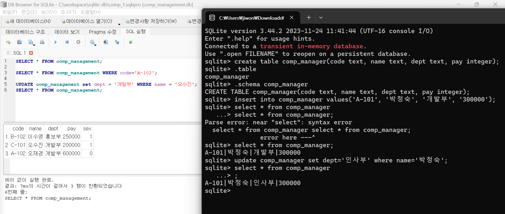
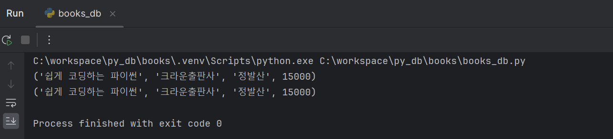

## 2023-12-15
### Todo 
- [x]  <알기쉬운 파이썬 SQL 코딩하기> 정리
- [x]  리눅스마스터1급 공부

### SQL
#### SQLite DB 설치
Precompiled Binaries for Windows - sqlite-tools-win-x64-3440200.zip
#### SQLite Browser 설치
DB Browser for SQLite - Standard installer for 64-bit Windows
#### SQLite DB 와 SQLite Browser 익히기 

#### PyCharm 설치
#### 아주 간단한 DB 프로그램 만들기
도서 정보에 관한 테이블 생성, 데이터 입력, 레코드 조회 실습
```python
import sqlite3

# 테이블 생성
def create_table() :
	conn = sqlite3.connect('C:/workspace/py_db/books/books.db') # books.db 파일 생성
	cursor = conn.cursor()
	cursor.execute('''CREATE TABLE books (book_name text, publisher text, writer text, price integer)''')
	conn.commit()
	conn.close()

# 실제 데이터 입력 방법
def insert_books() :
	conn = sqlite3.connect('C:/workspace/py_db/books/books.db')
	cursor = conn.cursor()
	insert_tuple_sql = 'insert into books values (?, ?, ?, ?)'
	cursor.execute(insert_tuple_sql, ('쉽게 코딩하는 파이썬', '크라운출판사', '정발산', 15000))
	conn.commit()
	conn.close()

# 레코드 조회
def select_all() :
	conn = sqlite3.connect('C:/workspace/py_db/books/books.db')
	cursor = conn.cursor()
	cursor.execute('select * from books')
	books = cursor.fetchall() # 모든 레코드를 반환하는 함수
	for i in books :
		print(i)
	conn.close()

# 프로그램 실행부분(함수호출 부분)
# 1회만 실행 → 2번째 실행한다면 오류가 발생하므로 주석
# create_table()
# insert_books()
select_all()

```

  `insert_books` 실행 중복...

