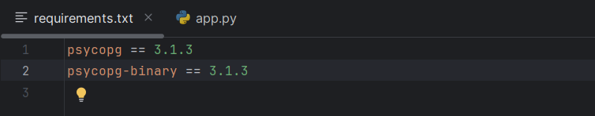
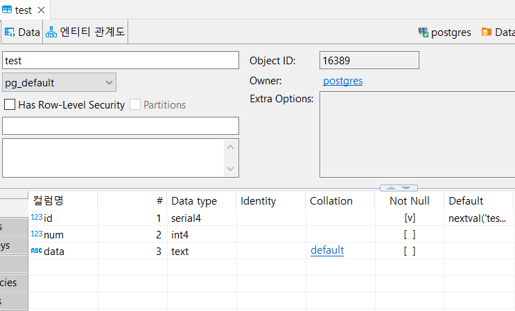

## 2024-01-09
### Todo
- [x]  데이터엔지니어링 캠프 - Python & SQL
- [x]  ADsP

### psycopg 데이터베이스 접근
#### ubuntu에서 docker, dbeaver 연결
#### 파이참 psycopg 라이브러리 설치
- `requirements.txt` 파일 생성, install


#### app.py 코드 작성 및 실행
```python
import psycopg;

# with psycopg.connect("dbname=test user=postgres") as conn:
with psycopg.connect("host=localhost dbname=postgres user=postgres password=postgres") as conn :
    with conn.cursor() as cur :
        cur.execute("""
        CREATE TABLE test(
            id serial PRIMARY KEY,
            num integer,
            data text)
        """)
    conn.commit()

# 엔트리 포인트
if __name__ == "__main__":
    pass
```
#### DBeaver 테이블 생성 확인


### psycopg
- connection은 어딘가에 있는 데이터베이스 서버와의 네트워크 연결을 담당
- cursor는 connection 성공 후, connection 객체로부터 얻어오며 cursor에 SQL 쿼리를 실행
- 데이터베이스로부터 리턴되는 값을 cursor를 통해 순차적으로 읽어온다.

### ADsP
요약집 1시간 30분 공부
